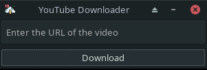

# tubecpy

<p align="center">
    
</p>

# Usage
Hi if you want to use my code follow these simple steps.

First clone the repository, for example in your ```Desktop```, with the following command:

```
git clone https://github.com/AntonioBerna/tubecpy.git
```
Now access the folder with the ```cd tubecpy/``` command, create a virtual environment and activate it with the following commands:

```
virtualenv venv
source venv/bin/activate
```

Now install the requirements for Python using the command:

```
(venv) [linux@linux tubecpy]$ pip install -r requirements.txt
```

>**NOTE:** make sure you have successfully activated the virtual environment.


Finally execute the command:

```
make
```

As if by magic, an executable called ```tubecpy``` will appear! Now you just need to use the ```./tubecpy``` command to download as many youtube videos as you want!

>**NOTE:** any videos you download will be saved in a directory called ```videos``` within the project folder.

# Todo

- [x] Add icon for linux users (see latest push)
- [ ] Fix latest updated for MACOS users and add ```icon.png```
- [ ] Add video title while waiting for download

Suggest me some improvements, contact me on Telegram ```@CleverCode```.
